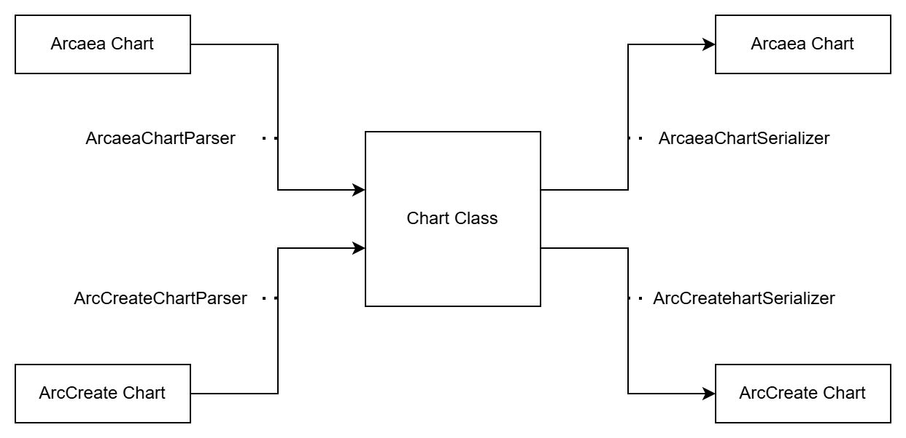

# aff-compose *v3*

This is a Kotlin Multiplatform library for parsing and serializing .aff files.

Last version of v2: [:link: v2.2.9999 \[b95a541\]](https://github.com/freeze-dolphin/aff-compose/releases/tag/v2.2.9999)

## Roadmap

- [x] parse .aff files
- [x] serialize .aff files
- [ ] advanced ArcCreate parser with expression and macro support

conversion of chart objects different between standards:

- [x] arcresolution
- [x] var-len arctap
- [x] conversion for scalars in scenecontrol and timing group fx

### support for other platforms

- [ ] C interop
- [ ] Python FFI
- [ ] dotnet

## Usage (Kotlin)

use [jitpack](https://jitpack.io/#freeze-dolphin/aff-compose) to add this library to your project

`settings.gradle.kts`:

```kotlin
dependencyResolutionManagement {
    repositoriesMode.set(RepositoriesMode.FAIL_ON_PROJECT_REPOS)
    repositories {
        mavenCentral()
        maven { url = uri("https://jitpack.io") }
    }
}
```

`build.gradle.kts`:

```kotlin
dependencies {
    implementation("com.github.freeze-dolphin:aff-compose:-SNAPSHOT") // or use a specific version
}
```

### Parse & Serialize

```kotlin
// parse
val chart = ArcaeaChartParser.Instance.parse(File("/path/to/chart.aff").readText()).chart

// serialize
val content = ArcaeaChartSerializer.Instance.serialize(chart).joinToString("\n")
```

see full example in [`commonTest/serialization.kt`](src/commonTest/kotlin/com/tairitsu/compose/serialization.kt)

#### Extensible API

Since v3, the library is refactored to provide an extensible api  
You can create your own chart parser and serializer if the internal ones does not cover your needs

Your parser should implement `ChartParser` (or simply extend `ArcaeaChartParser`)  
and your serializer should implement `ChartSerializer`

see more info in [`commonMain/parser`](src/commonMain/kotlin/com/tairitsu/compose/parser)


<details>
<summary>parser graph</summary>


</details>

### DSL

you can create a chart instance from Arcaea .aff file with slight changes：

- replace headers with `Chart.Configuration` in [`commonMain/chart.kt`](src/commonMain/kotlin/com/tairitsu/compose/chart.kt)
- `arc(...)[arctaps(1000),arctap(1200)]` -> `arc(...){arctap(1000); arctap(1200)}`
- `(1000,0)` -> `normalNote(1000,0)`
- `timinggroup(noinput_anglex1800)` -> `timinggroup(noinput, anglex(1800))`

see full example in [`nativeTest/serialization.kt`](src/nativeTest/kotlin/com/tairitsu/compose/serialization.kt)

there are also simplified APIs for creating chart objects, for instance:

```kotlin
// in a `Difficulty.() -> Unit` closure

val a1 = arcNote(
    1000, // time
    2000, // endTime
    0.5 pos 1, // startPos (x, y)
    s, // ease
    0.5 pos 0, // endPos (x, y)
    blue // color
)

val a2 = arc(
    1000, // time
    2000, // endTime
    0.5, // startPosX
    0.5, // endPosX
    s, // ease
    1, // startPosY
    0, // endPosY
    0, // color id
    none, // hitsound
    false // arcType (isGuidingLine)
)

// there two arc notes are equivalent
assertEquals(a1, a2)
```

see APIs in [`commonMain/compose.kt`](src/commonMain/kotlin/com/tairitsu/compose/compose.kt)

### Conversion

there is built-in conversion for chart objects that are different between games

see full example in [`commonTest/shim.kt`](src/commonTest/kotlin/com/tairitsu/compose/shim.kt)